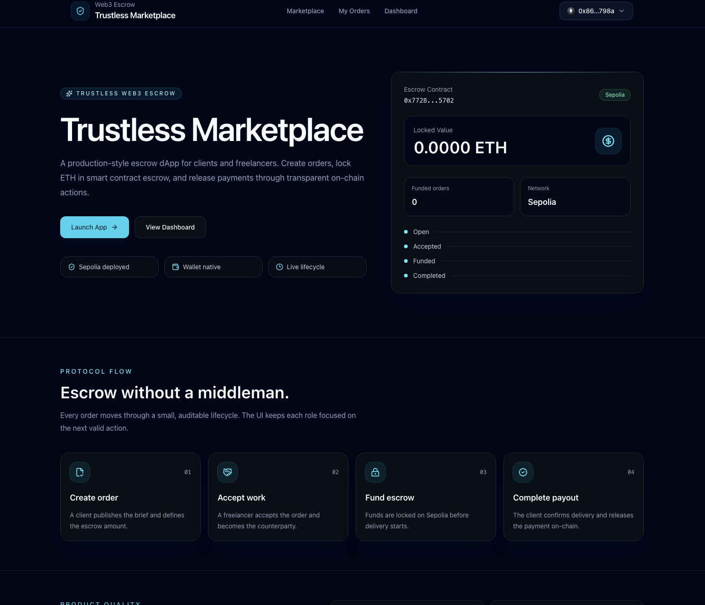
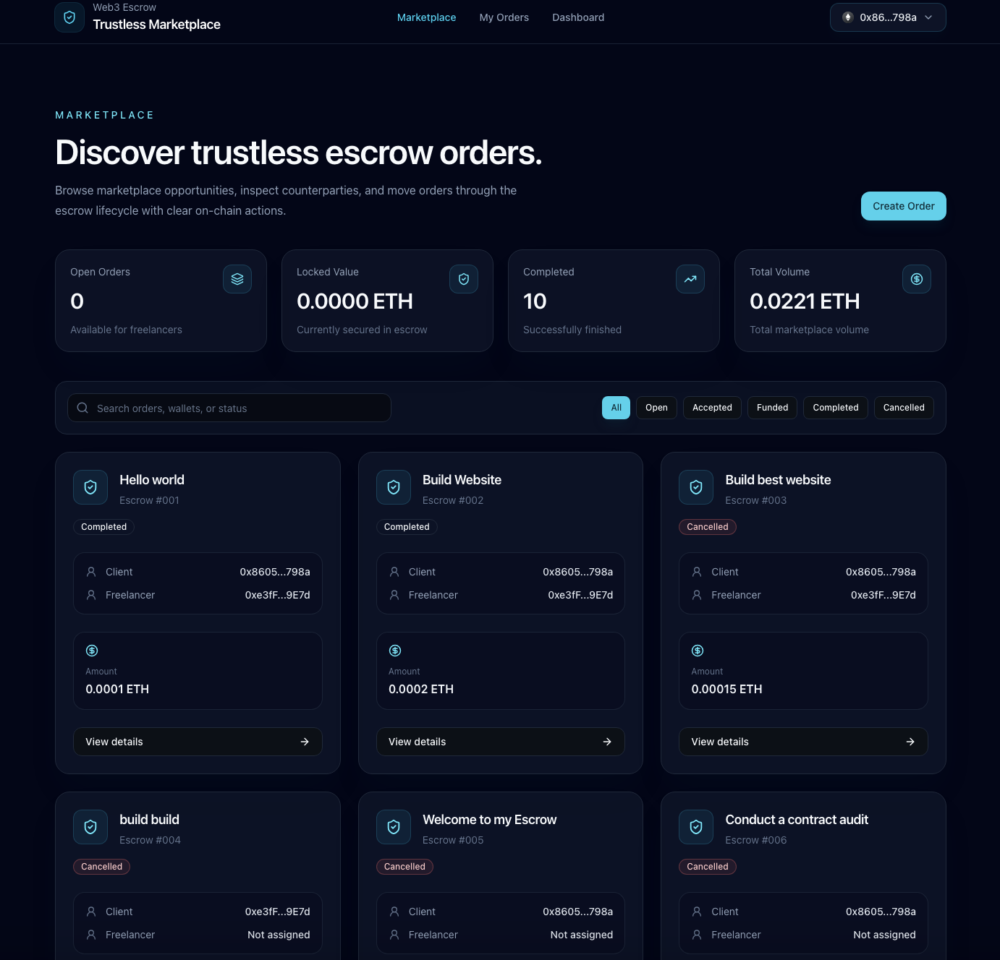
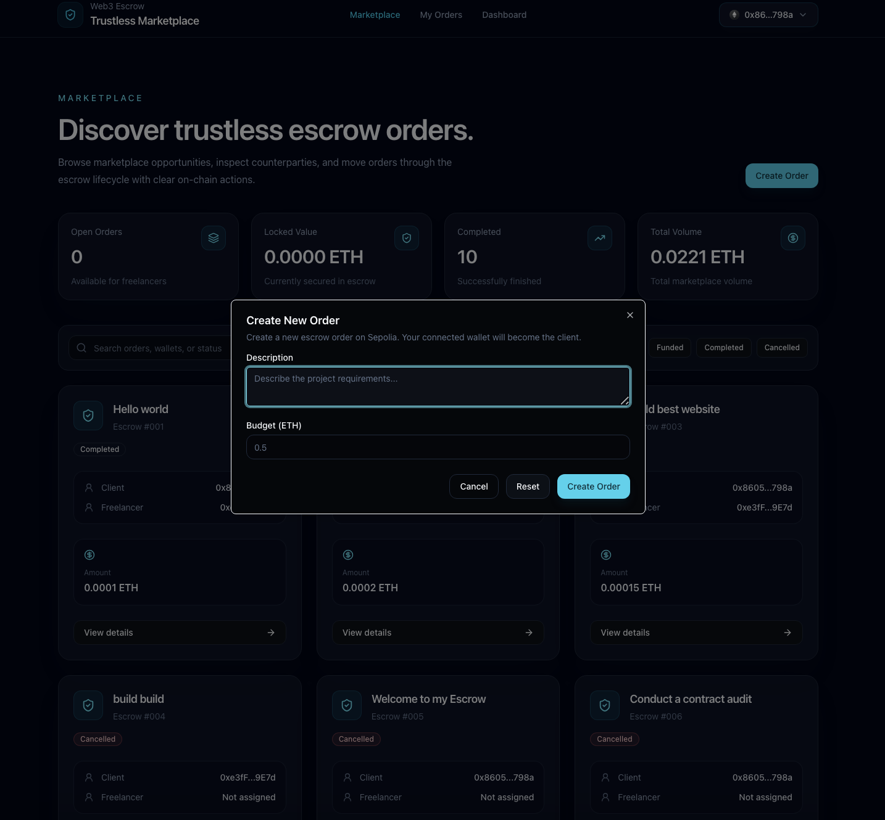
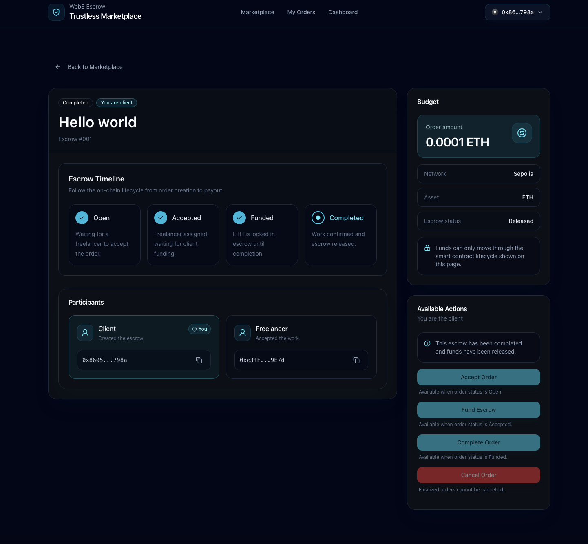
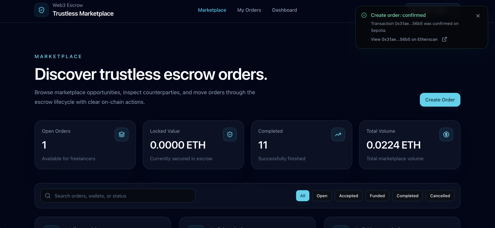
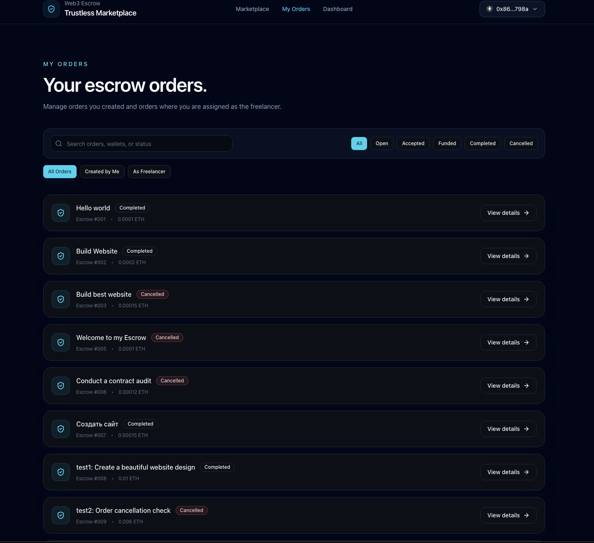
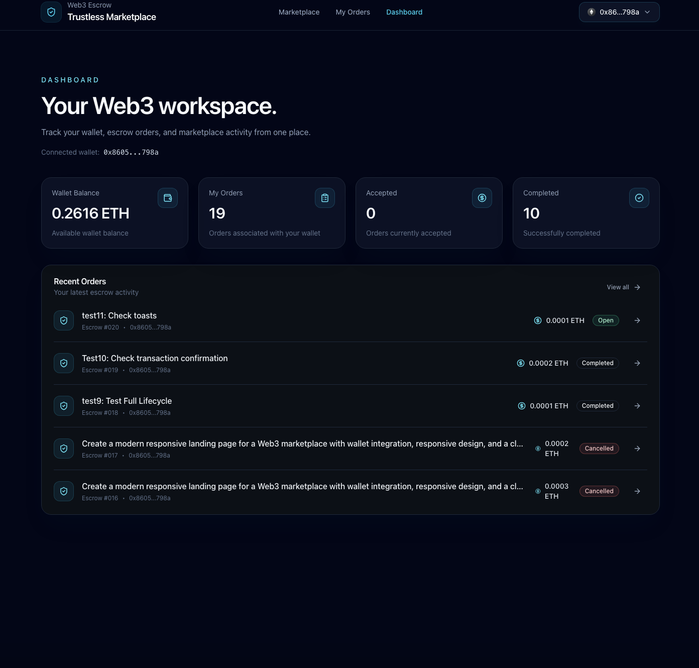

# Trustless Marketplace

A production-style Web3 escrow marketplace for clients and freelancers. Users can create work orders, accept them, lock ETH in escrow, release funds after completion, and track the full transaction lifecycle on Sepolia.

[Live Demo](https://trustless-marketplace-eight.vercel.app/) · [GitHub Repository](https://github.com/andrei-iarovoi/trustless-marketplace) · [Sepolia Contract](https://sepolia.etherscan.io/address/0x772857301abC99E453918f2A6112C8D6d3615702)



## Overview

Trustless Marketplace is a full-stack decentralized application built around a Solidity escrow smart contract and a modern React frontend. The project was redesigned from an old course assignment into a portfolio-ready Web3 product with a clean interface, reusable components, wallet-native flows, and production-oriented frontend architecture.

The application is deployed on Vercel and interacts with a live smart contract on the Sepolia testnet.

## Features

- Create escrow orders with a description and ETH budget
- Accept open orders as a freelancer
- Fund accepted orders through the escrow smart contract
- Confirm completion and release payment to the freelancer
- Cancel orders depending on lifecycle status
- Platform fee accumulation and owner withdrawal logic
- Wallet connection with RainbowKit and Wagmi
- Transaction lifecycle toasts for pending, submitted, confirmed, and failed states
- Etherscan links for submitted and confirmed transactions
- Marketplace search, filters, KPI cards, and order cards
- Order details page with participants, timeline, budget, status, and available actions
- My Orders page grouped by user role and order status
- Dashboard with wallet and marketplace metrics
- Responsive dark UI inspired by modern Web3 products

## Screenshots

### Marketplace



### Create Order



### Order Details



### Transaction Toasts



### My Orders



### Dashboard



## Escrow Lifecycle

```txt
Open -> Accepted -> Funded -> Completed
     -> Cancelled
```

Core flow:

1. Client creates an order with a budget.
2. Freelancer accepts the order.
3. Client funds the escrow with the exact ETH amount.
4. Client confirms completion.
5. Contract transfers payout to the freelancer and stores the platform fee.

## Tech Stack

### Frontend

- React 19
- TypeScript
- Vite 8
- React Router 7
- Tailwind CSS v4
- TanStack Query
- Wagmi
- Viem
- RainbowKit
- Radix UI primitives
- Lucide React
- Oxlint

### Smart Contracts

- Solidity 0.8.28
- Hardhat 3
- Hardhat Ignition
- OpenZeppelin Ownable
- OpenZeppelin ReentrancyGuard
- Viem-based contract tests
- Sepolia testnet

## Architecture

The frontend is structured so pages do not call blockchain APIs directly. Contract reads and writes are wrapped behind hooks and contract configuration modules, keeping UI components focused on presentation and interaction states.

```txt
frontend/src
  app/             App routing
  components/      Reusable UI, layout, marketplace, order, dashboard components
  config/          Wagmi and app configuration
  contracts/       Contract address, ABI, and shared contract config
  hooks/           Marketplace, dashboard, and Web3 transaction hooks
  pages/           Route-level pages
  providers/       App providers, wallet/query/toast setup
  types/           Shared TypeScript types
  utils/           Formatting and helper utilities
```

Smart contract responsibilities stay inside `TrustlessMarketplace.sol`: order lifecycle, role checks, escrow funding, payouts, cancellation rules, platform fee accounting, and fee withdrawal.

## Smart Contract

Deployed on Sepolia:

```txt
0x772857301abC99E453918f2A6112C8D6d3615702
```

Main contract capabilities:

- `createOrder(description, amount)`
- `acceptOrder(orderId)`
- `fundOrder(orderId)`
- `confirmCompletion(orderId)`
- `cancelOrder(orderId)`
- `withdrawFees()`
- `setPlatformFee(newFee)`

Security-related implementation details:

- Reentrancy protection on ETH transfer flows
- Custom Solidity errors
- Strict lifecycle checks
- Exact funding amount validation
- Owner-only fee withdrawal
- Platform fee capped at 10%

## Local Development

Clone the repository:

```bash
git clone https://github.com/andrei-iarovoi/trustless-marketplace.git
cd trustless-marketplace
```

Install root dependencies:

```bash
npm install
```

Install frontend dependencies:

```bash
cd frontend
npm install
```

Create frontend environment file:

```bash
cp .env.example .env
```

Add your WalletConnect Project ID:

```env
VITE_WALLETCONNECT_PROJECT_ID=your_walletconnect_project_id
```

Run the frontend locally:

```bash
npm run dev
```

## Contract Commands

From the project root:

```bash
npx hardhat compile
```

Run tests:

```bash
npx hardhat test
```

Deploy with Hardhat Ignition:

```bash
npx hardhat ignition deploy ignition/modules/TrustlessMarketplace.js --network sepolia
```

Required root environment variables for Sepolia deployment and verification:

```env
SEPOLIA_RPC_URL=your_sepolia_rpc_url
SEPOLIA_PRIVATE_KEY=your_private_key
ETHERSCAN_API_KEY=your_etherscan_api_key
```

## Frontend Commands

From `frontend/`:

```bash
npm run dev
npm run lint
npm run build
npm run preview
```

## Deployment

The frontend is deployed on Vercel from the `frontend` directory.

Recommended Vercel settings:

```txt
Framework Preset: Vite
Root Directory: frontend
Build Command: npm run build
Output Directory: dist
Install Command: npm install
```

Required Vercel environment variable:

```env
VITE_WALLETCONNECT_PROJECT_ID=your_walletconnect_project_id
```

The project includes a Vercel SPA rewrite config so direct navigation to routes such as `/marketplace`, `/my-orders`, `/dashboard`, and `/orders/:id` works correctly.

## Testing

The smart contract test suite covers:

- Order creation
- Accepting orders
- Preventing clients from accepting their own orders
- Escrow funding
- Incorrect funding amount reverts
- Completion payouts and fee accounting
- Owner fee withdrawal
- Non-owner withdrawal protection
- Cancellation rules for open, accepted, funded, and completed orders

Frontend checks:

- TypeScript production build
- Oxlint static analysis
- Manual lifecycle testing against Sepolia through the deployed UI

## Project Status

The current version is portfolio-ready and deployed. It demonstrates a complete Web3 escrow lifecycle with a polished React interface, wallet integration, contract reads/writes, transaction notifications, and production-like project structure.

Potential future improvements:

- Add deadline and timestamp fields to the smart contract
- Add ERC20 payment support
- Add dispute resolution flow
- Add event indexing with The Graph or a lightweight backend
- Add automated frontend tests with Playwright
- Add wallet/network onboarding states for unsupported networks

## Author

Built by [Andrei Iarovoi](https://github.com/andrei-iarovoi) as a portfolio Web3 project.
